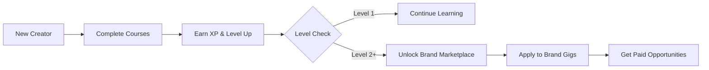

---

# 🎬 FrameUp - Learn Creative Arts & Unlock Brand Deals

A gamified learning platform where creators master video skills and get hired by global brands through verified skill progression.

## ✨ The Vision

FrameUp bridges the gap between creative education and real-world opportunities. Unlike traditional learning platforms that end with certificates, FrameUp creates a continuous loop where **learning leads directly to earning**. 

## 🎯 What Makes FrameUp Different

### The Learn-to-Earn Ecosystem
- **Educator-Guided Courses**: Structured training from seasoned directors and professional editors with real feedback on submitted footage 
- **Gamified Skill Ranking**: Earn XP for practical assignments, leveling up from Apprentice to Professional 
- **Locked Brand Marketplace**: High-paying gigs from top sponsors (Sony, DJI, Red Bull) are gated behind skill levels 

## 🚀 User Journey

## 🎮 The Gamification Engine

### Experience Points (XP) System
Creators earn XP through:
- Completing lecture milestones
- Submitting project artifacts
- Receiving educator grades

The XP bar visually tracks progress toward the next level unlock 

### Level-Based Progression
- **Level 1 (Apprentice)**: Access to foundational courses
- **Level 2 (Creator)**: Marketplace unlocks, brand gig access
- **Level 3 (Professional)**: Premium brand opportunities

## 💼 The Brand Marketplace

### Smart Gating System
The marketplace uses a two-layer security system to ensure quality:

1. **Global Market Lock**: Level 1 users see an overlay preventing access to brand deals 
2. **Individual Job Locking**: Each gig has specific level requirements, showing "Locked (Level X)" for inaccessible opportunities 

### Job Application Flow
When creators unlock a gig, they can:
- View detailed requirements and budget
- Submit a creative pitch
- Share portfolio links
- Get matched with brands

## 🎨 Creative Features

### Immersive Learning Environment
- **Video Lecture Player**: Professional video interface with progress tracking 
- **Project Workspace**: Dedicated area for lesson milestones and artifact submission 
- **Visual Badges**: Real-time achievement displays showing completed milestones 

### Dynamic UI Components
- **Level-Up Toast Notifications**: Celebratory animations when creators unlock new levels 
- **XP Progress Bars**: Visual representation of skill advancement  
- **Job Cards**: Rich display of brand opportunities with tags and budget info 

## 👥 Three-Sided Platform

### For Learners
- Structured creative courses
- Real educator feedback
- Clear progression path
- Direct brand access

### For Educators
- Dedicated grading dashboard 
- Submission review queue
- XP assignment capabilities
- Course building tools

### For Brands
- Pre-vetted talent pool
- Skill-verified creators
- Campaign management
- Direct pitch access

## 🎯 Getting Started

1. **Sign Up**: Create your creator profile
2. **Choose Your Path**: Select from video production, editing, or storytelling courses
3. **Start Learning**: Watch lectures and complete practical assignments
4. **Earn XP**: Submit work for educator review
5. **Level Up**: Unlock the brand marketplace
6. **Apply to Gigs**: Pitch to brands that match your skill level

## 🌟 Key Highlights

- **No Dusty Certificates**: Skills are verified through practical work, not paper
- **Real Income**: Platform directly connects learning to earning opportunities
- **Quality Control**: Educator grading ensures brand confidence
- **Motivation Engine**: Gamification keeps creators engaged and progressing

---

## Notes

This creative README focuses on the user experience and unique value propositions of FrameUp rather than technical implementation. The platform's core innovation is combining education with a marketplace, using gamification as the bridge between learning and earning. The two-layer gating system ensures both quality control and motivation for creators to continuously improve their skills.

