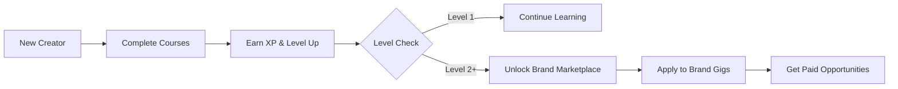

I'll create a creative README for FrameUp that focuses on the platform's story, features, and user experience rather than technical implementation details.

---

# 🎬 FrameUp - Learn Creative Arts & Unlock Brand Deals

A gamified learning platform where creators master video skills and get hired by global brands through verified skill progression.

## ✨ The Vision

FrameUp bridges the gap between creative education and real-world opportunities. Unlike traditional learning platforms that end with certificates, FrameUp creates a continuous loop where **learning leads directly to earning**. [1](#0-0) 

## 🎯 What Makes FrameUp Different

### The Learn-to-Earn Ecosystem
- **Educator-Guided Courses**: Structured training from seasoned directors and professional editors with real feedback on submitted footage [2](#0-1) 
- **Gamified Skill Ranking**: Earn XP for practical assignments, leveling up from Apprentice to Professional [3](#0-2) 
- **Locked Brand Marketplace**: High-paying gigs from top sponsors (Sony, DJI, Red Bull) are gated behind skill levels [4](#0-3) 

## 🚀 User Journey



## 🎮 The Gamification Engine

### Experience Points (XP) System
Creators earn XP through:
- Completing lecture milestones
- Submitting project artifacts
- Receiving educator grades

The XP bar visually tracks progress toward the next level unlock [5](#0-4) .

### Level-Based Progression
- **Level 1 (Apprentice)**: Access to foundational courses
- **Level 2 (Creator)**: Marketplace unlocks, brand gig access
- **Level 3 (Professional)**: Premium brand opportunities

## 💼 The Brand Marketplace

### Smart Gating System
The marketplace uses a two-layer security system to ensure quality:

1. **Global Market Lock**: Level 1 users see an overlay preventing access to brand deals [6](#0-5) 
2. **Individual Job Locking**: Each gig has specific level requirements, showing "Locked (Level X)" for inaccessible opportunities [7](#0-6) 

### Job Application Flow
When creators unlock a gig, they can:
- View detailed requirements and budget
- Submit a creative pitch
- Share portfolio links
- Get matched with brands

## 🎨 Creative Features

### Immersive Learning Environment
- **Video Lecture Player**: Professional video interface with progress tracking [8](#0-7) 
- **Project Workspace**: Dedicated area for lesson milestones and artifact submission [9](#0-8) 
- **Visual Badges**: Real-time achievement displays showing completed milestones [10](#0-9) 

### Dynamic UI Components
- **Level-Up Toast Notifications**: Celebratory animations when creators unlock new levels [11](#0-10) 
- **XP Progress Bars**: Visual representation of skill advancement [5](#0-4) 
- **Job Cards**: Rich display of brand opportunities with tags and budget info [12](#0-11) 

## 👥 Three-Sided Platform

### For Learners
- Structured creative courses
- Real educator feedback
- Clear progression path
- Direct brand access

### For Educators
- Dedicated grading dashboard [13](#0-12) 
- Submission review queue
- XP assignment capabilities
- Course building tools

### For Brands
- Pre-vetted talent pool
- Skill-verified creators
- Campaign management
- Direct pitch access

## 🎯 Getting Started

1. **Sign Up**: Create your creator profile
2. **Choose Your Path**: Select from video production, editing, or storytelling courses
3. **Start Learning**: Watch lectures and complete practical assignments
4. **Earn XP**: Submit work for educator review
5. **Level Up**: Unlock the brand marketplace
6. **Apply to Gigs**: Pitch to brands that match your skill level

## 🌟 Key Highlights

- **No Dusty Certificates**: Skills are verified through practical work, not paper
- **Real Income**: Platform directly connects learning to earning opportunities
- **Quality Control**: Educator grading ensures brand confidence
- **Motivation Engine**: Gamification keeps creators engaged and progressing

---

## Notes

This creative README focuses on the user experience and unique value propositions of FrameUp rather than technical implementation. The platform's core innovation is combining education with a marketplace, using gamification as the bridge between learning and earning. The two-layer gating system ensures both quality control and motivation for creators to continuously improve their skills.

Wiki pages you might want to explore:
- [Brand Jobs Marketplace (PritamDasCSE/frame-up)](/wiki/PritamDasCSE/frame-up#3.3)

### Citations

**File:** index.html (L45-48)
```html
  <div class="level-up-toast" id="level-up-toast">
    Level Up! 
    <span>Unlocked Level 2 and brand matches!</span>
  </div>
```

**File:** index.html (L50-63)
```html
  <!-- SECTION 1: LANDING PAGE -->
  <main class="page-section active" id="landing-section">
    <section class="hero">
      <div class="hero-content">
        <div class="hero-badge">
          <i class="fa-solid fa-bolt"></i> Learn &amp; Earn Marketplace
        </div>
        <h1>
          Master Video Skills.
          <span>Get Hired by Brands.</span>
        </h1>
        <p>
          FrameUp brings media educators, creative learners, and top global brands onto a single platform. Develop professional-grade videography and editing skills, get direct mentorship, and unlock paid campaigns as you level up.
        </p>
```

**File:** index.html (L78-92)
```html
          <div class="visual-badge visual-badge-1">
            <i class="fa-solid fa-video" style="color: var(--color-secondary);"></i>
            <div>
              <p style="font-size:0.75rem; font-weight:700; color:white; margin:0;">Videography Basics</p>
              <span style="font-size:0.65rem; color:var(--text-muted);">Completed Milestone 2</span>
            </div>
          </div>

          <div class="visual-badge visual-badge-2">
            <i class="fa-solid fa-trophy" style="color: var(--color-accent);"></i>
            <div>
              <p style="font-size:0.75rem; font-weight:700; color:white; margin:0;">Level 2 Unlocked</p>
              <span style="font-size:0.65rem; color:var(--text-muted);">Matching Gymshark Gigs</span>
            </div>
          </div>
```

**File:** index.html (L106-112)
```html
        <div class="feature-card">
          <div class="feature-icon">
            <i class="fa-solid fa-chalkboard-user"></i>
          </div>
          <h3>Educator-Guided Courses</h3>
          <p>Get structured step-by-step training from seasoned directors and professional editors. Receive real feedback on your submitted footage artifacts.</p>
        </div>
```

**File:** index.html (L115-121)
```html
        <div class="feature-card">
          <div class="feature-icon">
            <i class="fa-solid fa-chart-line"></i>
          </div>
          <h3>Gamified Skill Ranking</h3>
          <p>Earn experience points (XP) for finishing practical assignments. Level up from Apprentice to Professional, showing brands your verified capabilities.</p>
        </div>
```

**File:** index.html (L124-130)
```html
        <div class="feature-card">
          <div class="feature-icon">
            <i class="fa-solid fa-handshake"></i>
          </div>
          <h3>Locked Brand Marketplace</h3>
          <p>The USP of FrameUp: high-paying gigs from top sponsors (Sony, DJI, Red Bull) are locked behind levels. Complete work to open your gateway to brands.</p>
        </div>
```

**File:** index.html (L145-148)
```html
          <div class="xp-bar-container">
            <div class="xp-bar-fill" id="sidebar-xp-bar"></div>
          </div>
          <div class="xp-text" id="sidebar-xp-text">450 / 1000 XP</div>
```

**File:** index.html (L191-203)
```html
          <div class="video-player-container">
            <div class="video-mock">
              
              <div class="video-play-btn" id="video-play-btn">
                <i class="fa-solid fa-play"></i>
              </div>
              <div class="video-progress-bar" id="video-progress"></div>
            </div>
            <div style="padding: 1.5rem; border-top: 1px solid var(--border-light);">
              <h3 style="font-size: 1.15rem; margin-bottom:0.5rem;">Lecture #3: Mastering Keylights &amp; Dynamic Shadows</h3>
              <p style="font-size: 0.85rem; color:var(--text-muted); margin:0;">In this segment, Sarah Jenkins outlines how to position key and fill lights at 45-degree angles to generate standard dramatic portrait framing.</p>
            </div>
          </div>
```

**File:** index.html (L206-217)
```html
          <div class="workspace-tasks">
            <h3>Lesson Milestones</h3>
            <ul class="task-list" id="ws-tasks">
              <!-- Rendered by JS -->
            </ul>

            <div class="submission-box" id="ws-upload-btn">
              <i class="fa-solid fa-cloud-arrow-up"></i>
              <h4>Upload Project Artifact</h4>
              <p>Post your output video link for educator feedback and grade.</p>
            </div>
          </div>
```

**File:** index.html (L246-253)
```html
            <i class="fa-solid fa-bolt"></i> Unlocks at <span id="lock-level-indicator">Level 2</span>
          </div>
        </div>
      </div>

      <!-- Job Cards Container -->
      <div class="market-grid" id="market-grid">
        <!-- Rendered by JS -->
```

**File:** index.html (L258-292)
```html
  <!-- SECTION 5: EDUCATOR DASHBOARD -->
  <main class="page-section" id="educator-dashboard">
    <div class="portal-layout">
      <!-- Sidebar -->
      <aside class="portal-sidebar">
        <div class="user-summary">
          <div class="avatar-large" style="background: linear-gradient(135deg, var(--color-primary), var(--color-accent));">DF</div>
          <h3>Dr. Alistair Finch</h3>
          <p>Head Media Professor</p>
          
          <div class="xp-bar-container">
            <div class="xp-bar-fill" style="width: 100%; background: var(--color-accent);"></div>
          </div>
          <div class="xp-text">Educator Mode Active</div>
        </div>

        <ul class="sidebar-menu">
          <li><a class="sidebar-item active"><i class="fa-solid fa-list-check"></i> Grading Queue</a></li>
          <li><a class="sidebar-item" onclick="alert('Demo: Course builder tools interface is currently mock-only.')"><i class="fa-solid fa-plus"></i> Add New Syllabus</a></li>
        </ul>
      </aside>

      <!-- Content -->
      <div class="portal-content">
        <div>
          <h2 style="font-size:2rem; margin-bottom:0.5rem;">Review &amp; Assessment Center</h2>
          <p style="color:var(--text-muted);">Assess creative assignments uploaded by student learners. Assign grades to reward XP and unlock their job match profiles.</p>
        </div>

        <div class="grading-queue" id="grading-queue">
          <!-- Populated by JS -->
        </div>
      </div>
    </div>
  </main>
```

**File:** style.css (L555-575)
```css
}

/* Dashboard Workspace panels */
.portal-content {
  display: flex;
  flex-direction: column;
  gap: 2rem;
}

.grid-cards {
  display: grid;
  grid-template-columns: repeat(auto-fit, minmax(280px, 1fr));
  gap: 1.5rem;
}

/* Interactive Course Cards */
.course-card {
  background: var(--bg-card);
  border: 1px solid var(--border-light);
  border-radius: var(--border-radius-md);
  overflow: hidden;
```

**File:** style.css (L610-632)
```css
}

.course-tag {
  position: absolute;
  top: 1rem;
  left: 1rem;
  background: hsla(222, 47%, 6%, 0.8);
  padding: 0.25rem 0.75rem;
  border-radius: 50px;
  font-size: 0.75rem;
  font-weight: 600;
  border: 1px solid var(--border-light);
}

.course-body {
  padding: 1.5rem;
  display: flex;
  flex-direction: column;
  flex-grow: 1;
}

.course-body h3 {
  font-size: 1.15rem;
```
